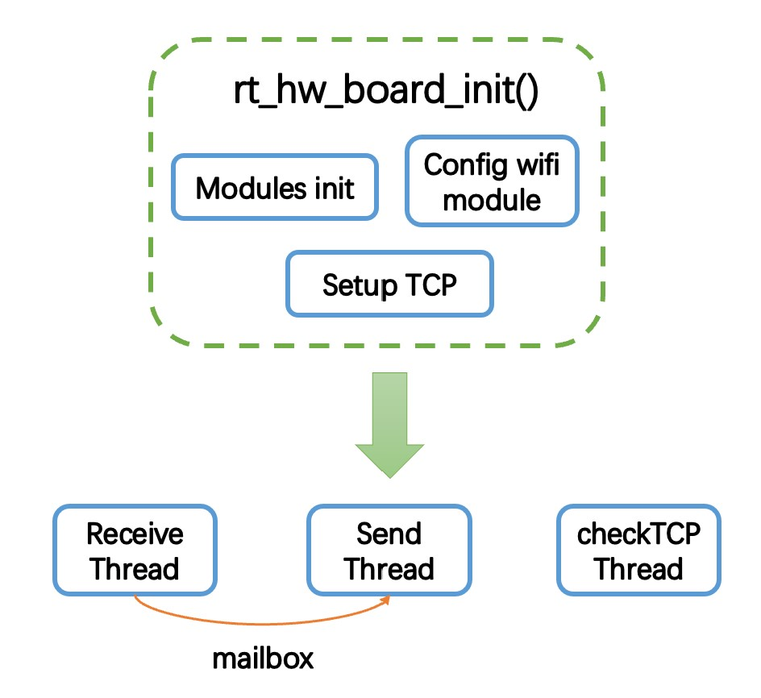

# Submodule of AutoPet Project -- MCU

## Description
一个用于控制投喂装置的MCU程序。

## Hardware

- [x] 正点原子stm32f1开发mini板
- [x] MG995舵机
- [x] DHT11温湿度传感器
- [x] ALK8266 WIFI模组

## Hardware interface

* wifi module
    * SCLK/MISO/MOSI --> PA5/PA6/PA7
    * nCS/nReset --> PA4/PA1
* dht11 module
    * data --> PC7
* pwm
    * pwm --> PB5

## Kernel
- [x] RT-Thread Nano

## Features

* USART1串口用于输入输出调试信息，RT-Thread的msh/finsh命令行工具支持命令行查询运行状态。搭配正点原子的XCOM串口调试助手使用。
* 通过舵机控制投喂阀门的开启。
* 通过温湿度传感器获取环境温湿度。
* WIFI模组目前还没发挥其高速传输的优势，因为图片/视频传输还没开发。配合AutoPet/Server和AutoPet/Android，实现远程控制。

* 使用stm32f103内部的实时时钟精确计时，晚间时间使wifi模组处于深度睡眠模式实现低功耗。
* 支持通过安卓端矫正RTC时间。

## Code Structure

* Modules init
    * 延时初始化
    * RTC初始化
    * 串口初始化
    * PWM初始化
    * DHT11初始化
    * wifi模块初始化

* SetupTCP
    * 建立TCP连接需要指定远端的服务器IP和端口，连接上以后需要发送身份码表明客户身份，否则会拒绝连接。

* 发送和接收线程
    * 初始化操作完毕后启动
    * 接收线程接收服务器发送的消息，通过邮箱与发送线程通信。
    * 发送线程接收到投喂指令则执行投喂函数，接收到获取温湿度指令则读取温湿度传感器并发送给服务器。

* 检查连接线程
    * 初始化操作完毕后启动
    * 隔一段时间检查一次模组的工作状态和TCP连接状态，进行异常排除。

* 设置空闲钩子函数监测时间，如果处于晚间，则使wifi模组睡眠；如果是白天，重启wifi模组。

